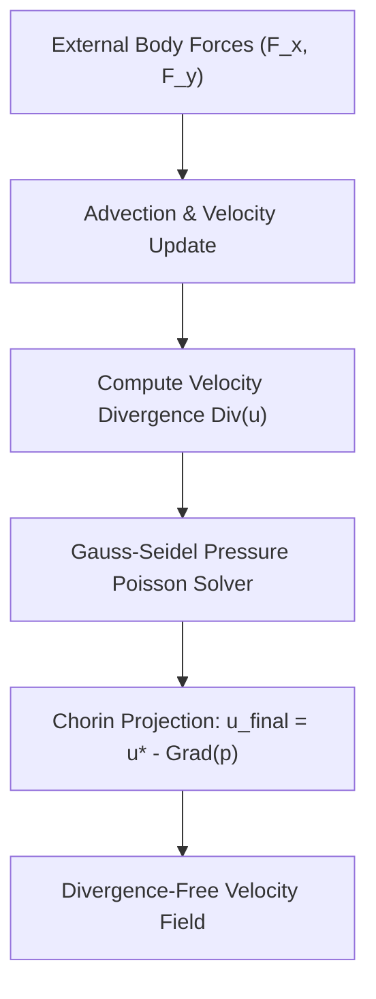

# genpark-navier-stokes-2d-fluid-solver-skill

Agent Skill implementing **2D Incompressible Navier-Stokes Fluid Dynamics** with Chorin's pressure projection method and Gauss-Seidel Poisson divergence reduction.

## Architectural Overview

